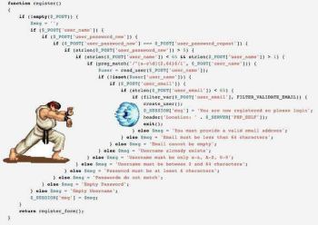

# ECMAScript 6

*A bright new future is coming...*

---


# Template Strings

*The thin line between `"hello world"` and `"hello" + name`*

----


## The old way

Everytime you need to mix strings with some dynamic content such as variables or function calls, you are probably going to use some string concatenation like this:

```
var name = "RomaJS";
console.log("hello" + name);
```

Fair enough! 
However when things get more complicated you will probably end up with something like:

```
var query = "SELECT " + column + " FROM " + this.db.getTable().name + ";";  
```

a hell of white spaces and plus symbols.

----


## The new way

besides double quotes and single quotes you can now use “backticks” to surround your strings.

```
"valid"
'valid'
`valid too`
```

but this is not another way to unescape quotes inside quotes or to make your inconsistent coding style yet more inconsistent...
backticks allows you to create template strings where you can use `${}` to wrap any arbitrary JavaScript code and insert its return value inside your string

```
console.log(`hello ${name}, 3+2 is ${3 + 2}`);
```

----

N.B. template strings may also span on multiple lines

```
var query = `SELECT ${column}
  FROM ${this.db.getTable().name};`;
```


----


### Tagged template strings

You may use tags to decide how template strings should be parsed.
basically a tag is a function of the form `TAG(str, val1, val2, val3, etc...)` where str is an array of strings separated by values
e.g. `str[1]${val1}str[2]${val2}str[3]${val3}` 

```
function TITLE(str, tag) {
  return `<h${tag}>${str[0].toUpperCase()}</h${tag}>`;
}

TITLE`ciao${1}` // returns "<h1>CIAO</h1>"
TITLE`ciao${3}` // returns "<h3>CIAO</h3>"
```


---


# Arrows

*because `function` keyword is boring*

----


## Syntatic => sugar

Arrows are a function shorthand using the `=>` syntax, inherited from C#, Java 8 and CoffeeScript.
As shortand arrows will not introduce new features but a new way to write compact code, more readable.

```
el.addEventListener('click', function (event) {
    console.log('Clicked!', event);
}
```

With arrows it will be one-line code

```
el.addEventListener('click', event => console.log('Clicked!', event));
```


----


## More examples

```
var n = [0, 1, 2, 3, 4];
var nPlusOne = n.map(v => v + 1);
var nPlusIndex = n.map((v, i) => v + i);
var nToObject = n.map(v => ({number: v, odd: v % 2 === 1}));

n.forEach(v => {
    if(v % 5 === 0)
        five.push(v);
});
```


----


## This or self?

Unlike functions, arrows share the same lexical `this` as their surrounding code.

### Before:

```
var bob = {
  _name: "Bob",
  _friends: [],
  printFriends: function() {
    var self = this;
    this._friends.forEach(function (f) {
      console.log(self._name + " knows " + f));
    });
    // or
    this._friends.forEach(function (f) {
      console.log(this._name + " knows " + f));
    }.bind(this));
    // or
    this._friends.forEach(function (f) {
      console.log(this._name + " knows " + f));
    }, this);
  }
}
```


----


### NOW:

```
var bob = {
  _name: "Bob",
  _friends: [],
  printFriends: function() {
    this._friends.forEach(f =>
      console.log(this._name + " knows " + f));
  }
}
```


---

# Promises

*how to avoid pyramid of doom*

----


## What is a pyramid of doom?

```
`(function($) {
  $(function(){
    $("button").click(function(e) {
      $.get("/test.json", function(data, textStatus, jqXHR) {
        $(".list").each(function() {
          $(this).click(function(e) {
            setTimeout(function() {
              alert("Hello World!");
            }, 1000);
          });
        });
      });
    });
  });
})(jQuery);`
```


----


## Back to simple stuffs

When we use async tasks ( and now we are using a lot of async tasks), we have to deal with callbacks: “EventLoop, please! Tell me when you have finished to do this”.

Sometimes we have a task that must be executed after another one, nesting the second in the first's callback.

```
fs.readFile('/etc/passwd', function (err, data) {
    if (err) throw err;
    console.log(data);
  
    fs.writeFile('/etc/passwd.bak', data function (err) {
      if(err) throw err;
      console.log('done!');
    });
});
```

What when you have more function nested?

----



----


## What are Promises?

A `Promise` represents an operation that hasn't completed yet, but is expected in the future.

Promise's constructor accept a function which will invoke `resolve` or `reject` based on the operation's result: success or fail.

```
new Promise(function(resolve, reject) {
    setTimeout(() => resolve(), 500);
});
```

A `Promise` is in one of these states:
 

* **pending**: initial state, not fulfilled or rejected.
* **fulfilled**: meaning that the operation completed successfully.
* **rejected**: meaning that the operation failed.


----


### Queue management

An object of type `Promise` has one method to handle status changes:  `Promise.then(`onFulfilled, ``onRejected`)`.

```
var queue = new Promise(function(resolve, reject) {
    setTimeout(() => resolve(10), 500);
});

queue.then(function (value) {
    console.log(value) // 10
}, function (error) {
    console.error(error);
});
```

The first callback passed to then will be invoked when the promise is fulfilled; the second when the promise is rejected.
The same arguments used in resolve function will be available as parameters of the callback.


----


### Error management

The second parameter of then() is optional. If it's not provided, the error bubbles down the queue until it found one error handler. If no one error handler is found, the exception is thrown outside the queue.

```
var queue = new Promise(function(resolve, reject) {
    setTimeout(() => reject('Error'), 500);
});
queue.then(function (value) {
    console.log(value);
})
.then(function (value2) {
    console.log(value2);
})
.then(function (value3) {
    console.log(value3);
}, function (error) {
    console.error(error); // Error 
});
```

This method ha is invoked when `resolve` or `reject` methods are invoked by the promise.


----


### Pro tip: .catch()

The Promise object has another method to handle errors: `.catch(onRejected)`. It is like `.then` method with undefined first parameter.

```
var queue = new Promise(function(resolve, reject) {
    setTimeout(() => reject('Error'), 500);
});

queue.then(function (value) {
    console.log(value);
})
.then(function (value2) {
    console.log(value2);
})
.then(function (value3) {
    console.log(value3);
})
.catch(error) {
    console.error(error); // Error 
});
```

This method ha is invoked when `resolve` or `reject` methods are invoked by the promise.

----


### Back to the future

```
fs.readFile('/etc/passwd', function (err, data) {
    if (err) throw err;
    console.log(data);
  
    fs.writeFile('/etc/passwd.bak', data function (err) {
      if(err) throw err;
      console.log('done!');
    });
});
```

can be like:

```
fs.readFile('/etc/passwd')
.then(data => fs.writeFile('/etc/passwd.bak', data))
.then(() => console.log('done'))
.catch(err => console.error('Error!', err));
```


----


### Managing multiple promises

Promises are perfect to deal with async tasks that should be executed consequently. But how manage tasks that can be executed concurrently?

`Promise.all()` accepts an array of promises and return a new promise that resolves when all of the promises in the array argument have resolved.

`Promise.race()` accepts an array of promises and return a new promise that resolves or rejects as soon as one of the promises in the array resolves or rejects, with the value or reason from that promise.

---


# Destructuring

*variable declaration like there's no tomorrow*

----

Destructuring allows binding using pattern matching, with support for matching arrays and objects. Destructuring is fail-soft, similar to standard object lookup `foo["bar"]`, producing `undefined` values when not found.

```
// list matching
var [a, , b] = [1,2,3];

// object matching
var { op: a, lhs: { op: b }, rhs: c } = getASTNode()

// object matching shorthand
// binds `op`, `lhs` and `rhs` in scope
var {op, lhs, rhs} = getASTNode()

// Can be used in parameter position
function g({name: x}) {
  console.log(x);
}
g({name: 5})

// Fail-soft destructuring
var [a] = [];
a === undefined;

// Fail-soft destructuring with defaults
var [a = 1] = [];
a === 1;
```


---


# Let & Const

*let me be variably constant*

----


## In the beginning was the var

We are all used to declare variables such as

```
var number = 4;
var str = "hello";
var arr = [1, 2, 3];
```

but... wait a moment...

```
var elements = [1, 2, 3, 4];
var functions = []

for (var i = 0; i < 5; i++) {
  functions.push(() => i);
}

console.log(functions[2]()); // 5 WTF!!??

 
```


----


## let and const: enjoy proper block scoping

in ES6 you can use `let` instead of `var` to create block scoped variables

```
var elements = [1, 2, 3, 4];
var functions = []

for (let i = 0; i < 5; i++) {
  functions.push(() => i);
}

console.log(functions[2]()); // 2
```

`const` are block scoped as well, but they may only be assigned once (however you are free to assign mutable elements to them such as objects)

----


## What about my dear old vars?

vars will continue to be supported and there are some situations where they may be useful, however `let` and `const` will probably become a de facto standard because of their flexibility and a more consistent behaviour that may leads to less weird bugs to debug.

`const` are not free immutable object, but using them to point out things that we do not want to change will surely help to have a more readable code as well as type errors when trying to reassign them. Beside of that we can easily assume that JS engines will probably be able to optimize memory management when knowing that a pointer will never change its pointed address.

---


# Classes

*OO developers of the world, unite!*

----

ES6 classes are a simple sugar over the prototype-based OO pattern. Having a single convenient declarative form makes class patterns easier to use, and encourages interoperability. Classes support prototype-based inheritance, super calls, instance and static methods and constructors.

----


## Goodbye Prototype

```
function Foo() {
   this.who = 'World';
}

Foo.prototype.sayHello = function() {
   return `Hello, ${this.who}!`;
}

Foo.helloRomaJS = function () {
   return 'Hello, RomaJS!';
}

var f = new Foo();
f.sayHello();
Foo.helloRomaJS();
```


----


## Goodbye Prototype

```
function Baz() {
   this.who = 'Gilles';
}

Baz.prototype = new Foo();
Baz.prototype.constructor = Foo;

var b = new Baz();
b.sayHello();
Baz.helloRomaJS();
```


----


## Welcome Class

```
class Foo {
   constructor() {
       this.who = 'World';
   }
   
   sayHello() {
       return `Hello, ${this.who}!`;
   }

   static helloRomaJS() {
       return 'Hello, RomaJS!';
   }
}

var f = new Foo();
f.sayHello();
Foo.helloRomaJS();
```


----


## Welcome Class

```
class Baz extends Foo {
   constructor() {
       super();
       this.who = 'World';
   }
}

var b = new Baz();
b.sayHello();
Baz.helloRomaJS();
```


----


## Pro Tip: Getter & Setter

```
class Polygon {
  constructor(height, width) {
    this.height = height;
    this.width = width;
  }
}

class Square extends Polygon {
  constructor(sideLength) {
    super(sideLength, sideLength);
  }
  get area() {
    return this.height * this.width;
  }
  set sideLength(newLength) {
    this.height = newLength;
    this.width = newLength;
  }
}
```


---


# Modules

Managing dependencies in JavaScript is always been a pain and until now we have faced a huge amount of fancy solutions:

* wild copy paste on a huge file hoping that hoisting will solve all your problems (but it won't)
* `< script src=....` keeping in mind the correct, or supposed so, order
* require.js
* commonJS (node.js)


----


## import/export to rule them all

in ES6 you will be able to use a new module system through the keywords `import` and `export.`
exports:

```
// lib.js
const PI = 3.14159;
export foo = () => "bar";
export PI;
export default () => "baz";
```

imports:

```
import baz from 'lib'; // will load the default export
import * as myLib from 'lib'; // myLib will contain all named exports: myLib.PI, myLib.foo
import baz, { foo, PI } from 'lib'; // baz is default export, foo and PI are named
```


----


## Not only syntactic sugar...

while the new module systems comes with a nicer syntax, the real change is that it do not allow dynamic modules (but you can still have them using System.import).
Forcing static modules has various advantages:

* performance (static reference vs object lookup)
* dependency tree parsing without executing any code
* cyclic dependencies

Also to note that the syntax is way nicer when dealing with modules with a single default export, this will hopefully and silently make the people to produce well designed modular libraries.

---


# Generators

*l'amor che move il sole e l'altre stelle*

----


## Iterators

In JavaScript ES6 an iterator is an object which implements a `next` method that returns an object in the form `{done: BOOL, value: nextValue}`
e.g.

```
function makeIterator(array) {
  var nextIndex = 0;
    
  return {
    next: function() {
      return nextIndex < array.length ?
        {value: array[nextIndex++], done: false} :
        {done: true};
    }
  }
}
```


----


## Iterables

An iterable is an object with a method `[Symbol.iterator]` that returns an iterator. You can iterate over iterables using `for...of`, spread operators and destructuring assignments.

```
let fibonacci = {
  [Symbol.iterator]() {
    let pre = 0, cur = 1;
    return {
      next() {
        [pre, cur] = [cur, pre + cur];
        return { done: false, value: cur }
      }
    }
  }
}
for (var n of fibonacci) {
  if (n > 1000)
    break;
  console.log(n);
}
```


----


## Generators

Generators are basically factories for iterators. They have to be declared using the `function* name() {}` form andshould have at least a `yield` statement.

```
var fibonacci = {
  [Symbol.iterator]: function*() {
    var pre = 0, cur = 1;
    for (;;) {
      var temp = pre;
      pre = cur;
      cur += temp;
      yield cur;
    }
  }
}
for (var n of fibonacci) {
  if (n > 1000)
    break;
  console.log(n);
}
```

`yield` specify the value to be returned by `next()`

----


## yield magic

while generators my simply look like functions with a star `*`, their behavior is quite different. While normal function will always run to completion and cannot be interrupted by external code, inside a generator a `yield` instruction will pause the program flow and will continue from the location where `next()` was invoked, then it will only resume to run to the next `yield` when `next()` is called again.

```
function* gen() {
  yield 1;
  console.log(2); //this instruction will never be executed
  yield 2;
}
let it = gen();
it.next() // { value: 1, done: false }
```

then if I call `next()` again...

```
it.next(); // returns { value: 2, done: false } and logs 2 on console
```


----


## message passing

`yield` and `next` have another nice superpower: they can communicate!

```
function* counter() {
  let i = 0;
  for (;;) {
    if ((yield i++) === 'reset') i = 0; 
  }
}

let it = counter();
it.next() // 0
it.next() // 1
it.next() // 2
it.next('reset') // 0
it.next() // 1
```


---


# Proxy

Proxies allows us to define customized fundamental behavior for a target object.

```
let p = new Proxy(target, handler);
```

`target` may be any kind of object (including functions  or arrays), while `handler` is an object with some specific methods called traps, that represent some typical operations that we cannot normally modify.

----

### traps

getPrototypeOf, setPrototypeOf, isExtensible, preventExtensions, getOwnPropertyDescriptor, defineProperty, has, get, set, deleteProperty, enumerate, ownKeys, apply, construct.

e.g.

```
p = new Proxy({}, {
  get(receiver, name) {
    return `hello ${name}`;
  }
});
console.log(p.world) // hello world
```


----


## what are they good for?

proxies are very useful in a lot of metaprogramming scenarios. Customized `get` and `set` can be used to log events, but also some fancier things like making an ajax call to reflect the changes on the local object on a remote one.
You can validate assignments, or define custom behaviors for constructors as well.
It is also possible to completely disable some behavior and have for example objects with properties that may be read, but not written.

----

Nice to know is the `Proxy.revocable(target, handler)` constructor that will return an object `{ proxy: {..}, revoke: fn}` making available a revoke functions that will totally disable the proxy. that way You will be able to revoke the proxy to some object when some particular events happen.

---


## Tail Call Optimization

Calls in tail-position are guaranteed to not grow the stack unboundedly. Makes recursive algorithms safe in the face of unbounded inputs.

```
// non tail-call
function factorial(n) {
  return (n <= 1)
    ? 1
    : n * factorial(n - 1);
}
```

```
// tail-call
function factorial(n, acc = 1) {
  return (n <= 1)
    ? acc
    : factorial(n - 1, n * acc);
}
```


---


# Other features

* enhanced object literals
* default + rest + spread
* unicode
* map + set + weakmap + weakset
* Math + Number + String + Array + Object APIs


---


# Questions?


---


# Thank you

@axyz
https://github.com/axyz

@matteomanchi
https://github.com/Takeno


